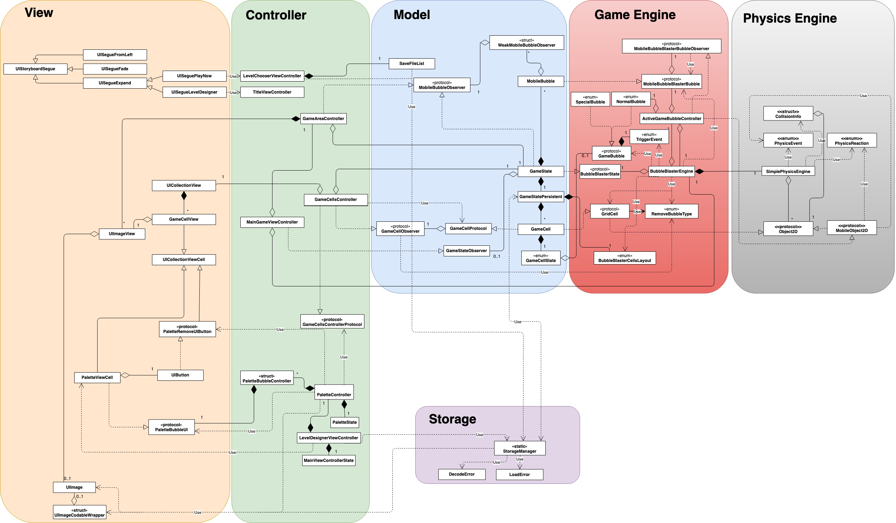

CS3217 Problem Set 5
==

### Set-up

The following are the steps to set up the Bubble Blaster project:

1. Ensure CocoaPods is installed.
2. Open terminal and navigate to the `/BubbleBlaster` folder
3. run the following command: `pod install`
4. Open `BubbleBlaster.xcworkspace` to open the project. (__NOT `.xcodeproj`__)

The following are fixes to common issues:
* If there are any issues with the pod, please run `pod deintegrate` and then go throught the above steps again.
* If an error similar to `dyld: Library not loaded: @rpath/libswiftAVFoundation.dylib` occurs on start up, please clean the build folder through `Debug -> Clean build folder` in XCode and then rebuild the project.

### Rules of the Game

1. The game is won when all bubbles are detached from the grid and there are no shot bubbles that have not been attached yet.
2. Prepackaged levels cannot be overwritten or deleted.
3. Levels cannot be started or saved if there are no non-empty cells in the grid.
4. Score is the number of bubbles shot. (So lower is better))

Special bubble chaining will be explained in 4.4

### Aiming the cannon

Very similar to BBTAN if you're familiar with the game.

The player has to pan in the direction opposite of the direction he wants to shoot the bubble (Like a slingshot). The direction only depends on the position the pan started and the current position of the gesture. Once the player lifts his/her finger from the screen, the bubble will be fired. If the direction to shoot intended is downwards, nothing will happen. Once the bubble is fired, the next bubble appears in it's position, ready for shooting.

When panning, a guideline is provided for the user to aid him/her in aiming. The line's length depends on the distance between the start and the current position of the pan. The further they are, the longer the line. This line will not be shown if the direction of it is downwards.

When the bubble is shot, the game reverses the direction of the pan and scales it's magnitude to be the speed defined in GameConstants and sets the velocity of the bubble as this resultant vector.

When there are __two cannons__, the cannon is selected based on which half of the screen the pan started. (left half for left cannon, right half for right cannon). Furthermore, the player can simultaneously start pans on both sides of the screen to aim the two cannons at once.

### Order of bubbles

The order is simply the order of the bubbles in the palette. Red -> Blue -> Green -> Orange. And this cycle will repeat with red being after orange. This is to provide consistency so that the player can strategize and not rely on random chance.

The upcoming bubbles are shown on the bottom of the game area from left to right with up to 5 upcoming bubbles being shown at any time. The next bubble will always be shown in the center bottom.

### Simplified Class Diagram
The following is the simplified class diagram for the application:

Many classes in the controller/model component also depend on the GameBubble protocol but the arrows were omitted to reduce clutter. Likewise for the controller component and UIImage.